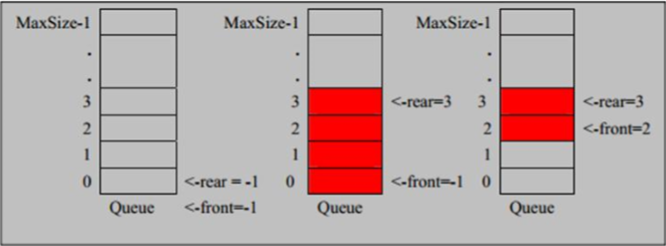

# 数组模拟队列

 	简介：数组模拟队列时候，需要一个位置来作为约定。所以建立一个n大小的队列需要n+1大小的数组来模拟。

​	重点：

1. rear (尾结点，入队的时候会移动使用)
2. front（头结点，出队时候会移动使用）
3. 判断队列是否为空：（头结点 == 尾结点）
4. 判断队列是否满：尾结点位置 + 1 % 数组长度 - 1  = 头结点位置
5. 判断队列的有效数据：【（尾结点位置 + 数组大小 - 1 - 头结点位置）% （数组大小 - 1）】

